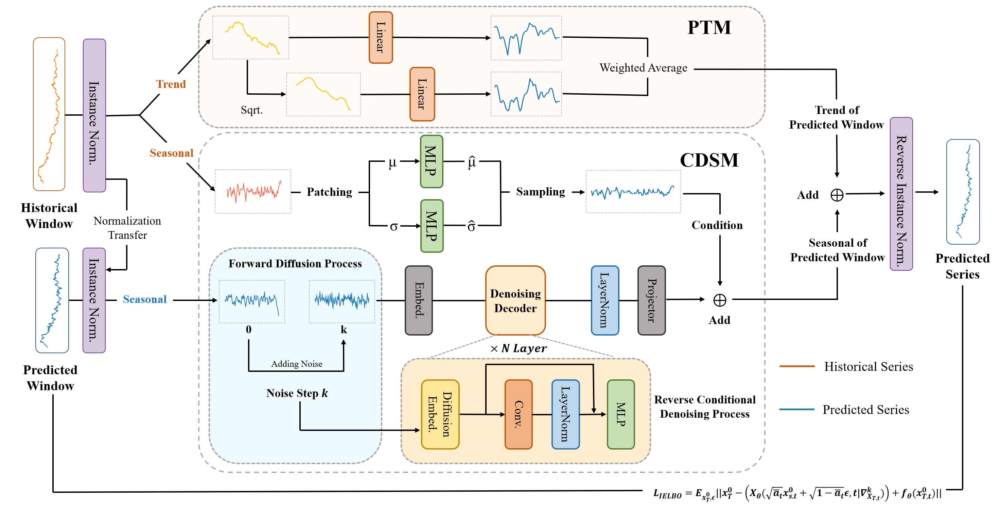

# Conditional Denoising Meets Polynomial Modeling: A Flexible Decoupled Framework for Time Series Forecasting

[](https://github.com/zjt-gpu/FDF/stargazers)
[](https://github.com/zjt-gpu/FDF/network/members)

> **Abstract:** Time series forecasting models are becoming increasingly prevalent due to their critical role in decision-making across various domains. However, most existing approaches represent the coupled temporal patterns, often neglecting the distinction between their specific components. In particular, fluctuating patterns and smooth trends within time series exhibit distinct characteristics. In this work, to model complicated temporal patterns, we propose a Conditional Denoising Polynomial Modeling (CDPM) framework, where probabilistic diffusion models and deterministic linear models are trained end-to-end. Instead of modeling the coupled time series, CDPM decomposes it into trend and seasonal components for modeling them separately. To capture the fluctuating seasonal component, we employ a probabilistic diffusion model based on statistical properties from the historical window. For the smooth trend component, a module is proposed to enhance linear models by incorporating historical dependencies, thereby preserving underlying trends and mitigating noise distortion. Extensive experiments conducted on six benchmarks demonstrate the effectiveness of our framework, highlighting the potential of combining probabilistic and deterministic models.


# Main Results


## Requirements
torch==2.4.1
pandas==2.2.3
scikit-learn==1.5.2
timm==1.0.10
einops==0.8.0
reformer_pytorch==1.4.4
wandb==0.18.3
pytorch_lightning==2.4.0
opt_einsum==3.4.0
linear_attention_transformer==0.19.1
matplotlib==3.9.2
thop==0.1.1.post2209072238

Dependencies can be installed using the following command:
```bash
pip install -r requirements.txt
```

## Dataset Preparation

We use the following five real-world datasets for our experiments. They are placed in the `./datasets` folder in the repository. Please ensure you adhere to each dataset's respective license when using them.

1. **ETTh**: *Informer: Beyond efficient transformer for long sequence time-series forecasting*. Available at [AAAI 2021](https://ojs.aaai.org/index.php/AAAI/article/view/17325).
2. **Exchange**: *Modeling Long- and Short-Term Temporal Patterns with Deep Neural Networks*. Available at [ACM Digital Library](https://dl.acm.org/doi/abs/10.1145/3209978.3210006).
3. **Weather**: Weather data is available at [https://www.bgc-jena.mpg.de/wetter/](https://www.bgc-jena.mpg.de/wetter/).
4. **Electricity**: Electricity consumption data is available at [UCI Machine Learning Repository](https://archive.ics.uci.edu/ml/datasets/ElectricityLoadDiagrams20112014/).
5. **Wind**: *Generative Time Series Forecasting with Diffusion, Denoise, and Disentanglement*. Available at [NeurIPS 2022](https://proceedings.neurips.cc/paper_files/paper/2022/hash/91a85f3fb8f570e6be52b333b5ab017a-Abstract-Conference.html).


## Usage

Commands for training and testing the FDF on Dataset ETTh1 and ETTh2 respectively:
```bash
# ETTh1
python -u run.py --model_name FDF --dataset ETTh1
More parameter information please refer to `args.py`.
# ETTh2
python -u run.py --model_name FDF --dataset ETTh2
More parameter information please refer to `args.py`.
```

## Acknowledgement

We extend our sincere appreciation to the following GitHub repositories for providing invaluable codebases:

[DDPM](https://github.com/lucidrains/denoising-diffusion-pytorch)
[CSDI](https://github.com/ermongroup/CSDI)
[Diffusion-TS](https://github.com/Y-debug-sys/Diffusion-TS)
[D3VAE](https://github.com/PaddlePaddle/PaddleSpatial/tree/main/research/D3VAE)
[Time-Series-Library](https://github.com/thuml/Time-Series-Library)

## Citation
If you find this repository useful for your work, please consider citing it as follows:

```bibtex
@article{zhang2024fdf,
  title={FDF: Flexible Decoupled Framework for Time Series Forecasting with Conditional Denoising and Polynomial Modeling},
  author={Zhang, Jintao and Cheng, Mingyue and Tao, Xiaoyu and Liu, Zhiding and Wang, Daoyu},
  journal={arXiv preprint arXiv:2410.13253},
  year={2024}
}
```
